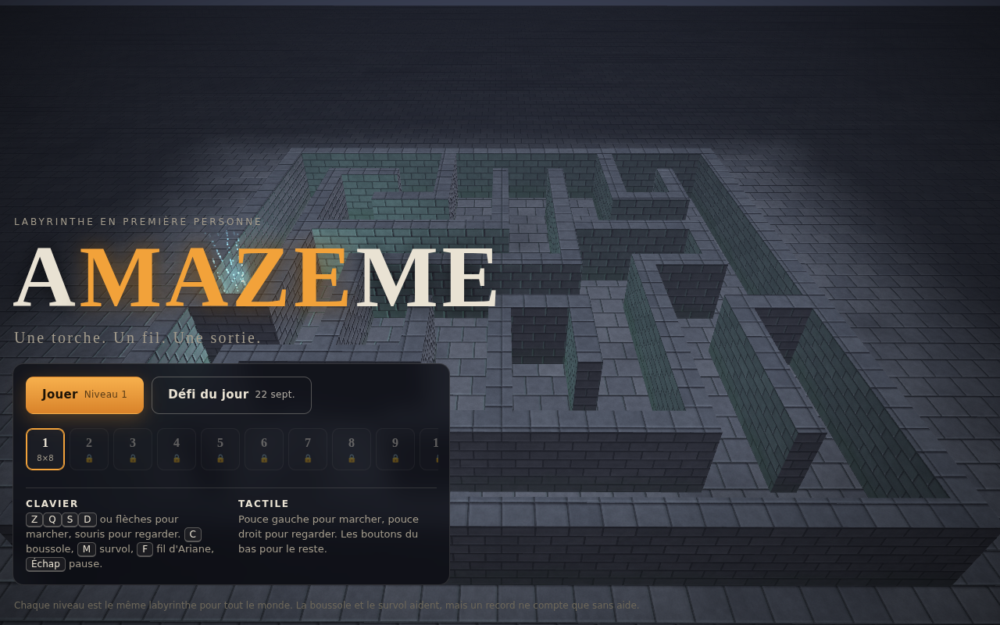
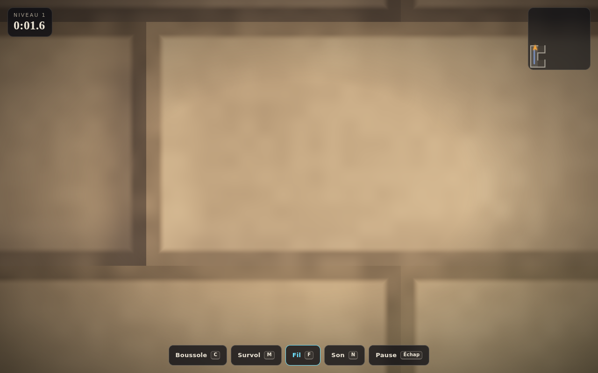
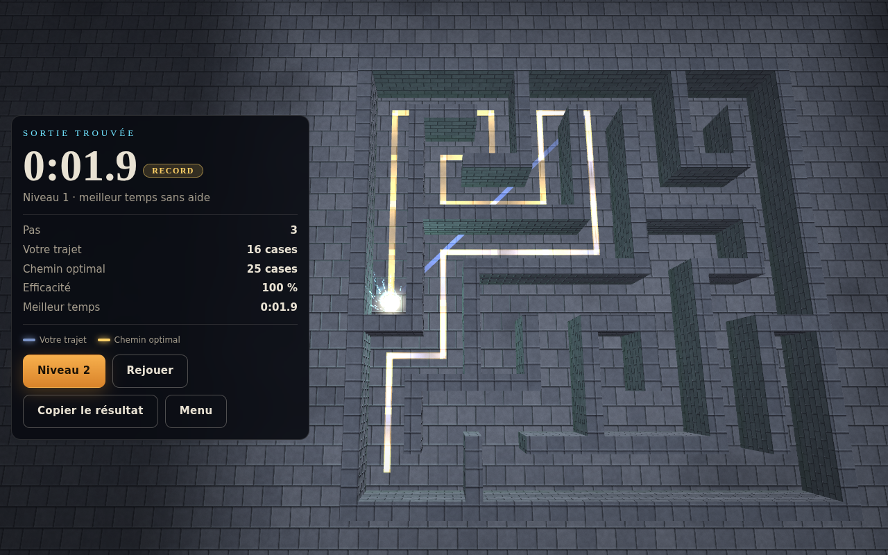
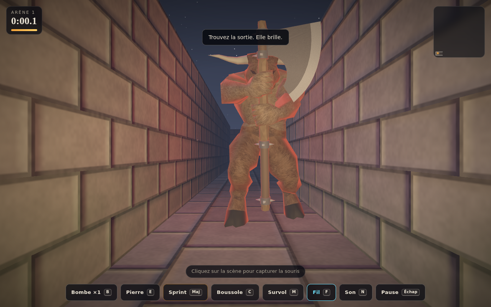

# Amazeme

Un labyrinthe en trois dimensions, à la première personne, dans un seul fichier HTML.
Pas de dépendance, pas de serveur, pas de build : ouvrez `index.html` et marchez.

## Jouer

- **En ligne** : la version publiée se joue directement sur téléphone comme sur ordinateur.
- **Hors ligne** : téléchargez `index.html` et ouvrez-le dans Safari, Chrome ou Firefox.

Chaque niveau est le même labyrinthe pour tout le monde : la graine est dérivée du numéro du niveau.
Le **Défi du jour** change chaque jour à minuit, identique pour tous les joueurs.

## Commandes

| | Marcher | Regarder | Boussole | Survol | Fil d'Ariane | Son | Pause |
|---|---|---|---|---|---|---|---|
| Clavier | `Z Q S D` ou flèches | souris (clic pour capturer) | `C` | `M` | `F` | `N` | `Échap` |
| Tactile | pouce gauche | pouce droit | bouton | bouton | bouton | bouton | bouton |

La boussole et le survol aident à trouver la sortie, mais un temps réalisé avec une aide ne compte pas comme record.

## À l'arrivée

La caméra s'élève au-dessus du labyrinthe. Votre trajet apparaît en bleu, le chemin optimal se dessine en or,
et la fiche compare les deux : temps, nombre de cases, efficacité, meilleur temps.

## Mode Minotaure

Dix arènes, de 14×14 à 32×32 cases. Un Minotaure erre dans les couloirs et ne sait rien de vous, jusqu'à ce que vous fassiez du bruit.

- **Il entend** : vos pas portent à cinq cases de couloir, neuf en sprint. Immobile, vous êtes silencieux. Les murs étouffent le son, la distance se mesure le long des couloirs et pas à vol d'oiseau.
- **Il cherche** : un bruit l'amène sur place, puis il fouille les environs quelques secondes avant de reprendre son errance.
- **Il voit** : à moins de treize unités, dans son champ de vision et sans mur entre vous, il charge. Plus vite que vous ne marchez. Il garde votre dernière position en tête quand il vous perd de vue.
- **Vous le sentez venir** : la lueur rouge qu'il porte se reflète sur les murs avant même qu'il n'apparaisse, le cœur bat plus vite, la vignette rougit, et il apparaît sur la carte dès qu'il est proche.

Vous n'êtes jamais sans solution :

| Outil | Touche | Effet |
|---|---|---|
| Sprint | `Maj` ou bouton maintenu | Plus rapide que lui pendant trois secondes, puis l'endurance se recharge. Bruyant. |
| Pierre | `E` | Lancée devant vous, elle claque en retombant et l'attire là-bas. Illimitée, un lancer toutes les quelques secondes. |
| Bombe | `B` | Posée à vos pieds, elle explose au bout de deux secondes : les quatre murs de la case tombent, ce qui ouvre un raccourci ou une issue. À moins de deux unités, le Minotaure est terrassé. À moins de cinq, il est sonné six secondes. Une bombe au départ, les autres brillent en rouge dans des impasses. |

Le classique fonctionne : une pierre près d'une bombe posée, et le Minotaure vient la chercher.

Modèle 3D du Minotaure : [Clint Bellanger](https://opengameart.org/content/minotaur), OpenGameArt, licence CC-BY 3.0. Le script `tools/export_minotaure.py` convertit le fichier Blender d'origine (maillage, poids, 24 images d'animation baked par os) en données compactes embarquées dans la page. Le rendu squelettique est fait dans un shader WebGL écrit pour l'occasion.

## Sous le capot

Tout tient dans `index.html` (environ 250 Ko, dont 150 Ko de modèle 3D) :

- **Génération** : backtracker récursif avec un goût pour les longs couloirs, puis ouverture d'une partie des impasses pour créer des boucles. La sortie est la cellule la plus lointaine du départ (parcours en largeur), ce qui donne aussi le chemin optimal.
- **Rendu** : WebGL 1 écrit à la main. Pierres, briques, mousse et dalles humides sont calculées dans le fragment shader, sans texture. Torche portée qui vacille, clair de lune, brouillard, ciel étoilé avec lune, colonne de lumière et étincelles à la sortie, poussière dans le faisceau de la torche.
- **Caméra** : trois modes (orbite du menu, première personne, survol) reliés par des transitions continues. Le passage du menu au jeu est un plongeon dans le labyrinthe.
- **Audio** : tout est synthétisé avec la Web Audio API. Nappe grave, vent, pas, chocs contre les murs, bourdon qui monte près de la sortie, fanfare d'arrivée, réverbération par convolution sur une impulsion générée.
- **Collisions** : cercle contre grille de blocs, glissement le long des murs.
- **Minotaure** : parcours en largeur depuis sa case pour mesurer les distances de couloir, lancer de rayon sur la grille pour la ligne de vue, machine à états errance, recherche, chasse, sonné, attaque.
- **Sauvegarde** : niveaux débloqués et meilleurs temps dans `localStorage`.

## Niveaux

Trente niveaux, de 8×8 à 40×40 cases. Un lien `index.html#l=12` ouvre directement le niveau 12, `#d` ouvre le défi du jour, `#m=3` ouvre l'arène 3 du Minotaure.
